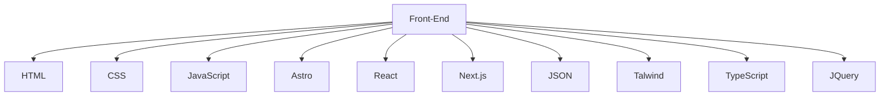

<h1>About me</h1>
I am an Information Systems Engineering student passionate about Frontend web development. I love creating fun and engaging user interfaces, and I strive to keep a simple content structure and clean design patterns in my projects. I enjoy exploring new technologies and looking for ways to improve user interactions.


<!----------------------------------------------------------------------------------------------->
[](https://github.com/ashutosh00710/github-readme-activity-graph)


<div align="center">  
   
  
  
</div> 

<!--------------------------------------------------------------------------------------------->
<p align="center">
 
<!-------------------------------------------------------------------------------------------------->
<p align="center"> Feel free to contact me if you want to talk about collaborations, interesting projects or just to chat about web development!
    <br/><br/><a href="https://www.linkedin.com/in/lucia-b-324a4927a" target="_blank"></a>
    <a href="https://www.instagram.com/lucia_benitez.1/" target="_blank"></a>
    <a href="https://twitter.com/luciaabtz" target="_blank"></a>
</p>
<p align="center"><a href="https://t.me/👽" target="_blank"></a>
    <a href="luciiabz.465@gmail.com" target="_blank"></a>
<p/>

<!----------------------------------------------------------------------------------------------------------->

```geojson
{
 "type": "FeatureCollection",
 "features": [
   {
     "type": "Feature",
     "id": 1,
     "properties": {
       "ID": 0
     },
     "geometry": {
       "type": "Polygon",
       "coordinates": [
         [
             [-57,-26.9],
             [-54.9,-26.9],
             [-54.9,-26.9],
             [-57,-26.9],
             [-57,-26.9]
         ]
       ]
     }
   }
 ]
}
```
<div align="center">
<br><p align="centre"><b>Visitas</b></p>  
<p align="center"></p> 
<br>
</div>

